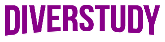

<div id="top"></div>
<h1 align="center">


</h1>
<h2 align='center' >Studying can be fun!</h2>
<p align="center"><i>“The roots of education are bitter, but the fruit is sweet.” – Aristotle</i> </p>

<div align="center">
    
     
    
    
    
    
    
</div>
<div align="center">
    
</div>

<h3 align="center">:link: <a href="https://diver-study-ewkrfsz1p.vercel.app/">Go to the preview (Vercel)</a></h3>
<h3 align="center">:link: <a href="https://github.com/Carol42/Disnil">Go to my 2<sup>nd</sup> project based on Alura's Imersão React</a></h3>
<h4 align="center">:brazil: <a href="./README.md">Ir para a versão em Português deste README »</a>
</h4>

<div align="center" alt="homepage screenshot">

</div>

<details>
    <summary>Table of Contents</summary>
    <ol>
        <li><a href="#pushpin-about">About</a></li>
        <li><a href="#diving_mask-the-immersion">The Immersion</a></li>
        <li><a href="#hammer_and_wrench-technologies">Technologies</a></li>
        <li><a href="#computer-how-to-download-and-run-the-project">How to download and run the project</a>
            <ul>
                <li><a href="#bulb-prerequisites">Prerequisites</a></li>
            </ul>
        </li>
        <li><a href="#woman_technologist-the-developer">The developer</a></li>
    </ol>
</details>

## :pushpin: About

DiverStudy is a platform that aims to help students to find high quality content to learn with as well as for teachers to find good content to use in their classes.

Here you will find YouTube videos covering advanced topics on our daily school subjects, as well as reviews and stuff explained in a ludic way, making it more interesting.

My main goal is to make knowledge accessible to those who need it. Showing the "stony road" in the middle of an information flood we find every day without knowing which path to follow.

I also want to make people interested in looking for knowledge and learning. Making the studying process funny, as the name of the platform suggests.

In times of fake news and disinformation, it's essential the spread of trustful information, as well as the stimuli to get interested and curious about them.

<div align="center">

</div>

<p align="right"><a href="#top"></a></p>

## :diving_mask: The Immersion

This project has been developed during the <a href="https://www.alura.com.br/imersao-react">Imersão React</a> organized by <a href="https://www.alura.com.br/">Alura</a> and taught by the instructors <a href="https://twitter.com/juunegreiros">Juliana Negreiros</a>, <a href="https://twitter.com/marcobrunodev">Marco Bruno</a> and <a href="https://twitter.com/omariosouto">Mario Souto</a>, with the special guest <a href="https://twitter.com/paulo_caelum">Paulo Silveira</a>.

The event was featured between the 27<sup>th</sup> and 31<sup>st</sup> of July 2020 and aimed to introduce the basic React concepts to develop a Netflix inspired application. The idea was to create your own video repository with the topic of your interest. One of my biggest interests is knowledge democratization, so that's the result! :)

Inspired by the project developed during the Immersion, I also developed the <a href="https://github.com/Carol42/Disnil">Disnil</a>, a "Nilce Moretto's Netflix".The idea came from a joke from <a href="https://www.instagram.com/nilmoretto/">@nilmoretto</a>'s story.

<div align="center">

</div>

<p align="right"><a href="#top"></a></p>

## :hammer_and_wrench: Technologies

- [React.js](https://reactjs.org/)
- [Json Server](https://www.npmjs.com/package/json-server)
- [React Router Dom](https://github.com/remix-run/react-router/tree/main/packages/react-router-dom)
- [Styled Components](https://styled-components.com/)
- [Concurrently](https://www.npmjs.com/package/concurrently)
- [prop-types](https://www.npmjs.com/package/prop-types)
- [react-slick](https://www.npmjs.com/package/react-slick)

<p align="right"><a href="#top"></a></p>


## :computer: How to download and run the project

### :bulb: Prerequisites

First of all, you will need to install the following tools on your computer: 
[Git](https://git-scm.com) and [Node.js](https://nodejs.org/en/). 

Moreover, it's good to have an editor to work on code, such as [VSCode](https://code.visualstudio.com/).

```bash
# Clone the repository
$ git clone https://github.com/Carol42/DiverStudy

# Go to the directory
$ cd DiverStudy

# Install the dependencies
$ npm install

# Start the project
$ npm run dev
```

<p align="right"><a href="#top"></a></p>

## :woman_technologist: The developer


</br>
<strong>Caroline Heloíse de Oliveira</strong>
</br>
<sup>Computer Engineering Student (UEPG)</sup>
</br>
<a href="https://github.com/Carol42"></a>
<a href="https://linkedin.com/in/carol42"></a>
<a href="mailto:carol42.helo@gmail.com"></a>

<p align="right"><a href="#top"></a></p>
