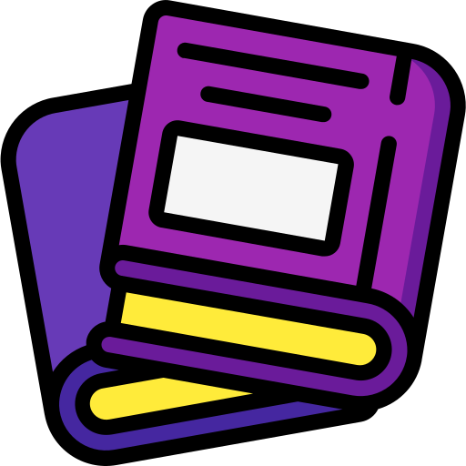
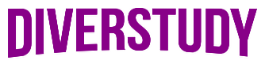

<div id="topo"></div>
<h1 align="center">


</h1>
<h2 align='center' >Estudar pode ser divertido!</h2>
<p align="center"><i>“The roots of education are bitter, but the fruit is sweet.” – Aristóteles</i> </p>

<div align="center">
    
     
    
    
    
    
    
</div>
<div align="center">
    
</div>

<div align="center">

</div>

<h3 align="center">:link: <a href="https://diver-study-ewkrfsz1p.vercel.app/">Acessar a demonstração</a></h3>
<h4 align="center">:us::gb: <a href="./README-en.md">Go to the English version of this README »</a>
</h4>

<details>
    <summary>Sumário</summary>
    <ol>
        <li><a href="#pushpin-sobre">Sobre</a></li>
        <li><a href="#hammer_and_wrench-tecnologias-utilizadas">Tecnologias utilizadas</a></li>
        <li><a href="#dinving_mask-a-imersão">A Imersão</a></li>
        <li><a href="#computer-como-baixar-e-rodar-o-projeto">Como baixar e rodar o projeto</a>
            <ul>
                <li><a href="#bulb-pré-requisitos">Pré requisitos</a></li>
            </ul>
        </li>
        <li><a href="#woman_technologist-a-desenvolvedora">A desenvolvedora</a></li>
    </ol>
</details>

## :pushpin: Sobre

DiverStudy é uma plataforma que visa auxiliar alunos a encontrarem conteúdos de qualidade para estudar e também a professores encontrarem conteúdo de apoio para utilizarem em sala de aula.

Aqui você poderá encontrar vídeos mais aprofundados sobre assuntos que vemos na escola, bem como revisões e conteúdos explicados de maneira prática com o intuito de tornar aquele assunto mais interessante.

Meu principal objetivo é tornar o conhecimento cada vez mais acessível a quem precisa. Mostrando "o caminho das pedras" no meio da enxurrada de informações que encontramos todos os dias sem saber por onde seguir.

Também tenho por objetivo fazer com que mais pessoas tenham interesse por buscar conhecimento e aprender. Tornar o aprendizado divertido, como o próprio nome da plataforma o sugere.

Em tempos de fake news e desinformação, torna-se essencial a divulgação de informações confiáveis e bem embasadas, assim como o estímulo às pessoas terem o interesse e a curiosidade de consumí-las.

<p align="right"><a href="#topo"></a></p>

<div align="center">

</div>

## :diving_mask: A Imersão

Esse projeto foi desenvolvido durante a <a href="https://www.alura.com.br/imersao-react">Imersão React</a> proposta pela <a href="https://www.alura.com.br/">Alura</a> e ministrada pelos instrutores <a href="https://twitter.com/juunegreiros">Juliana Negreiros</a>, <a href="https://twitter.com/marcobrunodev">Marco Bruno</a> e <a href="https://twitter.com/omariosouto">Mario Souto</a>, com a participação especial de <a href="https://twitter.com/paulo_caelum">Paulo Silveira</a>.

O evento ocorreu entre os dias 27 e 31 de julho e tinha como objetivo de apresentar conceitos básicos de React para construirmos uma aplicação inspirada na Netflix. A ideia era criar o seu próprio agregado de vídeos com assuntos de seu interesse. Como um de meus maiores interesses é a democratização do conhecimento, esse foi o resultado :)

<p align="right"><a href="#topo"></a></p>


## :hammer_and_wrench: Tecnologias utilizadas

- [React.js](https://reactjs.org/)
- [Json Server](https://www.npmjs.com/package/json-server)
- [React Router Dom](https://github.com/remix-run/react-router/tree/main/packages/react-router-dom)
- [Styled Components](https://styled-components.com/)
- [Concurrently](https://www.npmjs.com/package/concurrently)
- [prop-types](https://www.npmjs.com/package/prop-types)

<p align="right"><a href="#topo"></a></p>


## :computer: Como baixar e rodar o projeto

### :bulb: Pré requisitos

Antes de começar, você vai precisar ter instalado em sua máquina as seguintes ferramentas:
[Git](https://git-scm.com) e [Node.js](https://nodejs.org/en/). 

Além disso, é bom ter um editor para trabalhar com o código como o [VSCode](https://code.visualstudio.com/).

```bash
# Clonar o repositório
$ git clone https://github.com/Carol42/DiverStudy

# Entrar no diretório
$ cd DiverStudy

# Instalar as dependências
$ npm install

# Iniciar o projeto
$ npm run dev
```

<p align="right"><a href="#topo"></a></p>

## :woman_technologist: A desenvolvedora


</br>
<strong>Caroline Heloíse de Oliveira</strong>
</br>
<sup>Estudante de Engenharia de Computação (UEPG)</sup>
</br>
<a href="https://github.com/Carol42"></a>
<a href="https://linkedin.com/in/carol42"></a>
<a href="mailto:carol42.helo@gmail.com"></a>

<p align="right"><a href="#topo"></a></p>
